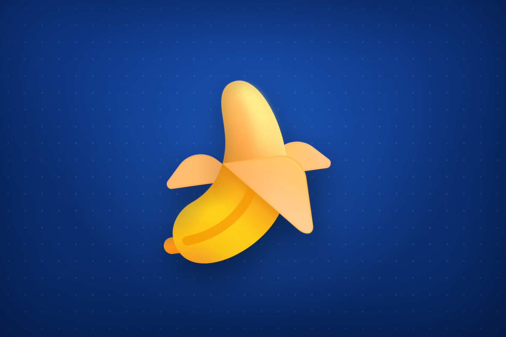
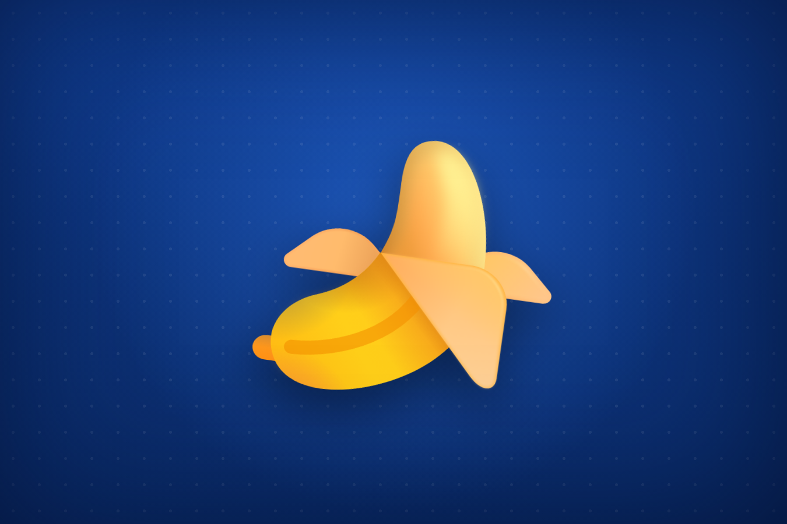

<div align="center">

# telepeel

*A self-contained instrument for observing a single banana<br>as it bounces, sways, and squashes — full-bleed, offline, forever.*


[](index.html)
[](index.html)
[](https://github.com/microsoft/fluentui-emoji)
[](index.html)
[](LICENSE)

**[🍌 Watch it dance in your browser](https://claude.ai/code/artifact/7a01895f-271f-4a63-bcce-e0595d6c43ca)** · **[▶ Demo loop](media/demo.gif)** · **[🎨 The banana (Fluent Emoji)](https://github.com/microsoft/fluentui-emoji/tree/main/assets/Banana)**

</div>

---

## Getting started & staying tuned with us.

Star us, and you will receive all release notifications from GitHub without any delay!

<a href="https://github.com/ninjahawk/telepeel/stargazers">
  
</a>

---

## Overview

telepeel is a single HTML file that renders one banana, dancing, on a
professional padded blue field, and nothing else. There is no build step, no
bundler, no framework, and no network request at runtime: the entire page —
markup, choreography, and the banana itself — is served from one document that
works the moment it is opened and works with the cable unplugged.

The banana is Microsoft's Fluent Emoji "Banana," a glossy, partially-peeled
vector render, embedded as a base64 `data:` URI directly in the page. Because
it is inlined rather than linked, its internal gradient and filter identifiers
stay isolated, it survives a strict content-security policy, and it stays
razor-crisp at any size — the display fills the viewport.

telepeel differs from a static emoji in that it is *continuous*: the banana is
never at rest. A single CSS keyframe animation drives it through a bounce, a
side-to-side sway, and a squash-and-stretch, on a fixed loop, at the browser's
native frame rate, indefinitely.

## Three moments from the loop

The value of the instrument is the choreography — the poses the banana passes
through that a still image cannot show. Three frames from one 1.05-second
period:

**1. Rest.** The bottom of the loop. The banana sits at its baseline, rotated
slightly counter-clockwise, at full scale — the anchor pose the animation
departs from and returns to.



**2. The leap.** A quarter of the way through, the banana is at the top of its
bounce — translated up, rotated the other way, and stretched taller than it is
wide. This is the squash-and-stretch principle: the body elongates as it rises.


**3. The landing lean.** At the midpoint the banana is back down but leaning
hard the opposite direction, now scaled wider than it is tall — the "squash"
half of the pair, absorbing the impact before springing back up.



These are the exact frames the loop cycles through; the demo above is the full
sequence played back at rendering speed.

## Reading the display

- **The field is the background, not a card.** Layered radial and linear
  gradients build the deep professional blue; a fine dot pattern gives it a
  quilted, padded texture; an inset vignette darkens the edges for depth. It
  fills the whole viewport.
- **The banana fills the stage.** It is sized to the viewport height (60vh),
  centered, and carries a soft drop shadow so it reads as floating above the
  field rather than pasted onto it.
- **Motion encodes the dance.** `translateY` is the bounce, `rotate` is the
  sway, and non-uniform `scale` is the squash-and-stretch. The three run
  together on one timeline.
- **The loop is 1.05s, `ease-in-out`, infinite.** The easing gives the bounce
  its weight — slow at the extremes, fast through the middle.
- **It respects `prefers-reduced-motion`.** If the viewer's system asks for
  reduced motion, the banana holds still.

## Method

```
browser (single HTML file — no build, no bundler, no runtime network)
    Microsoft Fluent Emoji "Banana" (Color SVG, MIT)
        → base64 data: URI, inlined into an 
    CSS @keyframes dance:
        translateY  (bounce)  +  rotate (sway)  +  scale (squash & stretch)
        1.05s ease-in-out, infinite;  transform-origin 50% 88%
    full-viewport blue field:
        layered radial + linear gradients
        quilted dot texture (repeating radial-gradient)
        inset vignette (box-shadow)
```

The page is one file. The banana travels with it as a `data:` URI, so there is
nothing to fetch and nothing to break — the same document renders identically
opened from disk, served over HTTP, or dropped into a sandboxed frame with a
strict CSP.

## Validation

The page was rendered in headless Chromium and the animation frame-sampled
across one full 1.05-second period. This README's `demo.gif` and the three
still poses above *are* those captured frames — the documentation is a direct
recording of the running page, not a mockup. The `prefers-reduced-motion`
branch was confirmed to halt the loop.

## Setup

There is nothing to install. Clone and open the file:

```bash
git clone https://github.com/ninjahawk/telepeel
cd telepeel
xdg-open index.html          # macOS: open index.html
# or serve it:
python3 -m http.server 8000  # → http://localhost:8000
```

**Hosted.** A live, shareable copy runs as an
[Artifact](https://claude.ai/code/artifact/7a01895f-271f-4a63-bcce-e0595d6c43ca).
`index.html` sits at the repository root, so it also serves as-is from GitHub
Pages or any static host.

## Limitations

The instrument reads out exactly one vocabulary token: *banana*. Concepts
requiring a second banana are invisible. The dance is a fixed 1.05-second loop,
not generative — it will not surprise you on the hundredth viewing. The page
commits, deliberately, to a single visual theme; there is no light mode. It is
non-nutritional, and it does not peel.

## Acknowledgements

The banana is [Fluent Emoji](https://github.com/microsoft/fluentui-emoji) by
Microsoft (MIT). telepeel is an independent project and is not affiliated with
Microsoft.

Licensed under MIT.
