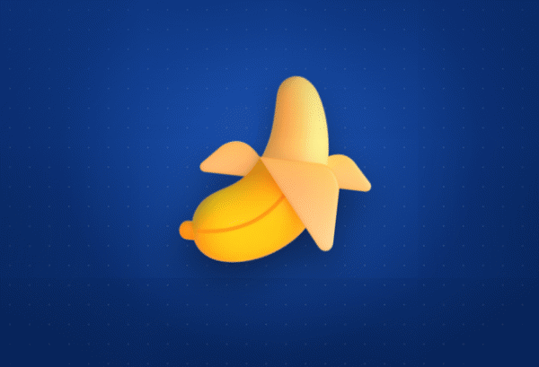
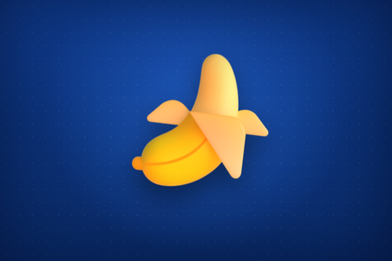
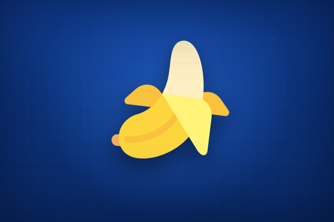
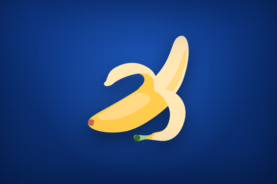
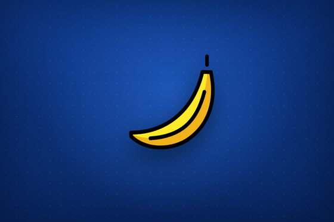
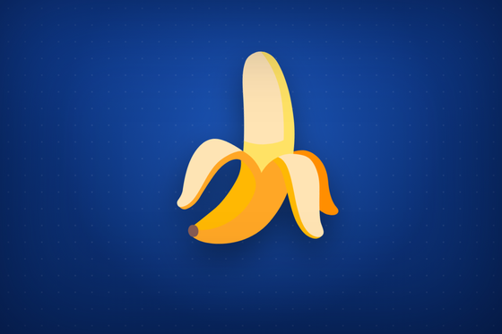

<div align="center">

# telepeel

*A self-contained instrument for observing a banana<br>as it bounces, sways, and squashes — dancing through six different bananas as it goes.*



[](index.html)
[](index.html)
[](#the-bananas-it-cycles-through)
[](index.html)
[](LICENSE)

**[🍌 Watch it dance in your browser](https://claude.ai/code/artifact/7a01895f-271f-4a63-bcce-e0595d6c43ca)** · **[▶ Demo loop](media/demo.gif)** · **[🎨 The bananas](#the-bananas-it-cycles-through)**

</div>

---

## Getting started & staying tuned with us.

Star us, and you will receive all release notifications from GitHub without any delay!

<a href="https://github.com/ninjahawk/telepeel/stargazers">
  
</a>

---

## Overview

telepeel is a single HTML file that renders one banana, dancing, on a
professional padded blue field, and nothing else. There is no build step, no
bundler, no framework, and no network request at runtime: the entire page —
markup, choreography, and every banana — is served from one document that works
the moment it is opened and works with the cable unplugged.

The banana is not one image but **six**. The page carries a set of six distinct
banana renderings — three from Microsoft's Fluent Emoji (3D, Color, Flat) and
one each from Twemoji, OpenMoji, and Noto — each embedded as a base64 `data:`
URI directly in the document. As it dances, the display crossfades from one
banana to the next, cycling through all six and looping. The identity of the
banana is itself in motion.

Because every asset is inlined rather than linked, their internal identifiers
stay isolated, they survive a strict content-security policy, and the vector
types stay razor-crisp at any size — the display fills the viewport.

telepeel differs from a static emoji in that it is *continuous* on two axes at
once: the body is never at rest (a bounce, a sway, a squash-and-stretch on a
fixed loop) and neither is the asset (a rolling crossfade through six banana
types). Nothing is ever fetched; nothing ever stops.

## The bananas it cycles through

Six types, embedded in the page, crossfaded in order. Each is a genuinely
different drawing of the same fruit:

| | | |
|:---:|:---:|:---:|
|  |  |  |
| **Fluent 3D** — glossy, rendered | **Fluent Color** — vector gloss | **Fluent Flat** — flat vector |
|  |  |  |
| **Twemoji** — peeled, cartoon | **OpenMoji** — outlined | **Noto** — Google's classic |

## Reading the display

- **The field is the background, not a card.** Layered radial and linear
  gradients build the deep professional blue; a fine dot pattern gives it a
  quilted, padded texture; an inset vignette darkens the edges for depth. It
  fills the whole viewport.
- **The banana fills the stage.** It is sized to the viewport height (60vh),
  centered, and carries a soft drop shadow so it reads as floating above the
  field rather than pasted onto it.
- **The asset cycles.** Two stacked image layers crossfade every 1.05s; one
  fades out as the next fades in, advancing through the six types and looping.
- **Motion encodes the dance.** `translateY` is the bounce, `rotate` is the
  sway, and non-uniform `scale` is the squash-and-stretch. All three run
  together on the dancer, underneath the swapping asset.
- **The loop is 1.05s, `ease-in-out`, infinite.** The easing gives the bounce
  its weight — slow at the extremes, fast through the middle.
- **It respects `prefers-reduced-motion`.** If the viewer's system asks for
  reduced motion, both the dance and the cycling stop; the first banana holds
  still.

## Method

```
browser (single HTML file — no build, no bundler, no runtime network)
    six banana assets, each inlined as a base64 data: URI:
        Fluent 3D (PNG) · Fluent Color · Fluent Flat · Twemoji · OpenMoji · Noto
    crossfade cycler (vanilla JS):
        two stacked  layers, opacity transition 0.4s
        advance every 1.05s → next asset fades in, current fades out, loop
    CSS @keyframes dance (on the .dancer wrapper):
        translateY (bounce) + rotate (sway) + scale (squash & stretch)
        1.05s ease-in-out, infinite;  transform-origin 50% 88%
    full-viewport blue field:
        layered radial + linear gradients
        quilted dot texture (repeating radial-gradient)
        inset vignette (box-shadow)
```

The page is one file. Every banana travels with it as a `data:` URI, so there
is nothing to fetch and nothing to break — the same document renders
identically opened from disk, served over HTTP, or dropped into a sandboxed
frame with a strict CSP. The cycler preloads all six on startup, so each
crossfade is instant.

## Validation

The page was rendered in headless Chromium and sampled deterministically across
one full cycle — ten dance phases for each of the six banana types. This
README's `demo.gif` is that sequence; the six stills above are one frame of each
type, captured from the running page, not mockups. The
`prefers-reduced-motion` branch was confirmed to halt both the dance and the
cycling.

## Setup

There is nothing to install. Clone and open the file:

```bash
git clone https://github.com/ninjahawk/telepeel
cd telepeel
xdg-open index.html          # macOS: open index.html
# or serve it:
python3 -m http.server 8000  # → http://localhost:8000
```

**Hosted.** A live, shareable copy runs as an
[Artifact](https://claude.ai/code/artifact/7a01895f-271f-4a63-bcce-e0595d6c43ca).
`index.html` sits at the repository root, so it also serves as-is from GitHub
Pages or any static host.

**Adding or reordering bananas.** The asset set is the `BANANAS` array in the
inline script; drop in another `data:` URI and it joins the rotation.

## Limitations

The instrument reads out exactly one concept — *banana* — in six spellings.
Concepts requiring a seventh banana are, for now, out of scope. The dance is a
fixed 1.05-second loop, not generative; it will not surprise you on the
hundredth viewing. The page commits, deliberately, to a single visual theme;
there is no light mode. It is non-nutritional, and none of the six bananas
peel.

## Acknowledgements

The bananas come from six open emoji sets, each retaining its own license:

- **Fluent Emoji** (3D, Color, Flat) — [Microsoft](https://github.com/microsoft/fluentui-emoji), MIT
- **Twemoji** — [Twitter / jdecked](https://github.com/jdecked/twemoji), graphics CC-BY 4.0
- **OpenMoji** — [OpenMoji](https://openmoji.org/), CC BY-SA 4.0
- **Noto Emoji** — [Google](https://github.com/googlefonts/noto-emoji), Apache 2.0

telepeel is an independent project and is not affiliated with any of the above.
The project code is licensed under MIT.
